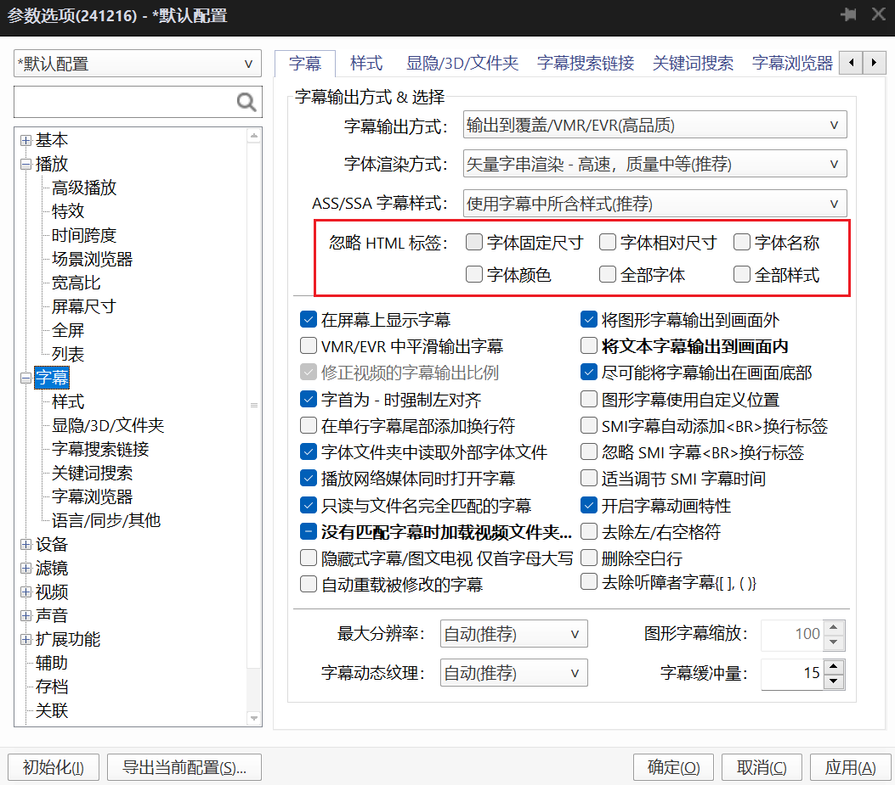

# StrFormat
## **概述**  

默认的字幕文件（.srt）只包含文本内容，没有字体、颜色、大小等样式信息。这些信息由播放器设置，并对中英文一视同仁。导致显示效果不佳（英文字体太大、中英文字体颜色相同等情况）。

如：  
    
此脚本用于为字幕文件（.srt）添加自定义字体和样式。支持中文和英文字幕的字体、大小自定义。用户可以选择文件，设置字体和大小，输出带样式的字幕文件。如：

    

## GUI版本
   

### 依赖
- Python 3.x
- tkinter

### 原理
- **界面设计**：使用`tkinter`库创建窗口、标签、输入框、按钮等控件，组织布局并绑定事件处理函数。
- **模板管理**：将模板数据存储在`templates.json`文件中，通过读取和写入该文件实现模板的保存和加载。
- **文件处理**：通过`tkinter`的文件对话框或拖拽事件获取文件路径，并进行有效性检查。
- **样式应用**：根据用户输入的设置，调用`add_styles_to_subtitles`函数对字幕文件进行处理，并生成新的带样式的字幕文件。

### 使用方法
1. **打开GUI界面**：运行`gui_version.py`脚本，打开图形用户界面。
2. **选择或拖拽文件**：在界面中选择或拖拽一个.srt文件到文件输入框。
3. **设置样式**：在界面中输入或选择中文和英文字体、大小、颜色等设置（可留空使用默认值）。
4. **管理模板**：可以保存当前设置为模板，或从已有模板中选择应用，或删除不需要的模板。
5. **处理字幕**：点击“处理字幕”按钮，程序将生成带样式的字幕文件，保存在同一目录下。
6. **查看结果**：处理完成后，状态栏会显示处理结果和输出文件路径。

### 输出文件命名
文件将输出在输入文件的同一目录下。  
输出文件名格式为：  
`<中文字体>_<英文字体>_<输入文件名>.srt`  
如果中文和英文字体相同，输出文件名格式为：  
`<中文字体>_<输入文件名>.srt`


## **字体说明**  
- 默认字体样式：中英文字体都为`寒蝉端黑体 Compact`。中文字体加粗，英文字体不加粗。中文字体大小为`18`，英文字体大小为`12`。  
- 默认字体颜色：中文字体为`#C8C8C8`，英文字体为`#H0F94CB`。  
  显示效果如下：  
    
- 字体样式原理：
  - 中文添加前缀`{\fn寒蝉端黑体 Compact\fs18\1c&HC8C8C8&}`，分别表示字体名称、字体大小、字体颜色。
  - 英文添加前缀`{\fn寒蝉端黑体 Compact\fs12\1c&H0F94CB&\b0}`。`\b`表示字重，`0`为不加粗。

## `.srt` 文件使用说明
直接将设置样式后的`.srt`文件拖入正在播放对应视频的播放器（如`PotPlayer`）即可。  
在`PotPlayer`中，要显示`.srt`字幕文件的字体样式，需要将字幕设置中的`忽略HTML标签`全部设置为不勾选，如图：  
   

## 参考链接
- 使用`SrtEdit`进行设置样式（《双语字幕文件的特效处理》）：https://www.doc88.com/p-0856439840568.html
- 字体`寒蝉端黑体 Compact`：https://github.com/Warren2060/ChillDuanSans  
- 字幕示例：《被解救的姜戈》（Django Unchained）官方中英双语字幕：https://subhd.tv/a/568803

## 可能的改进
- ~~GUI界面~~
- ~~支持更多字体样式设置~~
- ~~新增更多模板供选择~~
- ~~支持用户自定义模板~~
- 支持更多字幕文件格式（如`.ass`）

## 旧：命令行版本
### 功能
- 从指定文件夹选择 `.srt` 文件
- 支持中文和英文字幕分别自定义字体和大小
- 支持仅中文、仅英文的字幕设置。如只有中文，“英文字幕”相关设置不生效。如只有英文，则程序当作“中文字幕”处理，同样“英文字幕”相关设置不生效
- 按文件名优先级自动推荐最可能的文件
- 输出带有样式（字体、颜色、大小）的字幕文件

### 安装与运行
1. 克隆或下载该项目。
2. 在命令行中进入项目目录。
3. 运行脚本：
   ```bash
   python main.py
   ```

### 使用流程
1. 输入文件夹路径，程序会列出该目录下所有 `.srt` 文件。
2. 选择一个文件（默认选择优先级最高的文件）。
3. 输入中文和英文字体、大小（可留空使用默认值）。
4. 程序将生成带样式的字幕文件，保存在同一目录下。

### 文件优先级
- `ChsEng` > `Chs` > `Ch` > `其他`（不区分大小写）。
- 默认优先选择包含 `ChsEng` 的文件。


### 示例
输入文件夹路径：`./subtitles`  
找到文件：
```
1. [Likely] 1_ChsEng.srt
2. 2_Chs.srt
3. 3_ch.srt
```
选择文件 1 后：（按下回车自动选择带 `[Likely]` 标签的文件）
- 输入中文字体：`思源黑体`（留空按回车默认为`寒蝉端黑体 Compact`）
- 输入英文字体：`Arial`（留空按回车默认与中文字体相同）
- 输入中文字体大小：`20`（留空按回车默认为`18`）
- 输入英文字体大小：`16`（留空按回车默认为`12`）

输出文件：`思源黑体_Arial_1_ChsEng.srt`